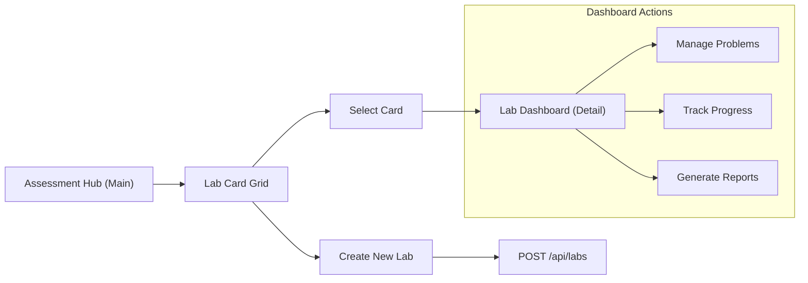
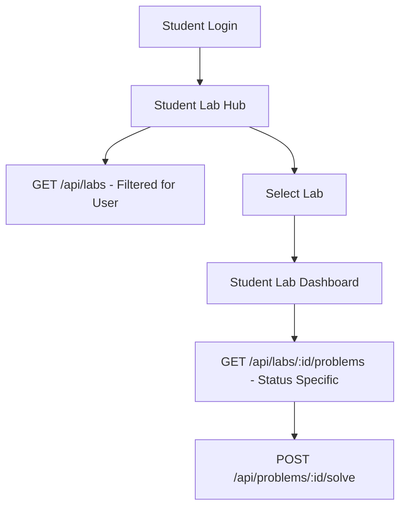

# Lab Management & Assessment API Specification

This document outlines the API requirements for the Lab Management and Assessment modules. It describes the user flows and data structures to guide backend implementation.

## 1. User Flows & Interaction Logic

### 1.1 Teacher/Admin Management Flow
The core flow focuses on the orchestration of labs: from initial listing (Cards) to detailed management (Dashboard) and scaling (Creation).



### 1.2 Student (User) Flow


---

## 2. Component Requirements

### 2.1 Main Assessment Page (Selection)
- **Teacher View**: Shows cards for all created labs.
- **Student View**: Shows cards for labs the student is enrolled in.
- **Data Needed**: Lab metadata, participant count, problem count.

### 2.2 Teacher Lab Dashboard
The dashboard provides high-level oversight of a specific lab.
- **Stats Required**:
    - `totalStudents`: Total enrolled.
    - `completedProblems`: Aggregate count of successful submissions.
    - `averageScore`: Mean performance across all students.
    - `activeSubmissions`: Submissions requiring review or recent activity.
- **Problem Management**: A table listing problems with fields: `Topic`, `Level`, `Status`, `AssignDate`, `DueDate`.

### 2.3 Student Lab Dashboard (Hub)
A personalized view for students to track their progress.
- **Featured Stats**:
    - `Total Tasks`: Total assigned problems.
    - `Remaining`: Unsolved problems nearing deadline.
    - `Completed`: Successfully solved problems.
    - `In Review`: Problems submitted but pending verification.
- **Curriculum List**: Detailed table of assigned work with "Solve" action.

---

## 3. Data Models

### Lab Object
```json
{
  "id": "string",
  "name": "string",
  "description": "string",
  "lab_hrs": "number",
  "group_name": "string",
  "total_problems": "number",
  "created_at": "ISO-8601-string"
}
```

### Problem Object (Contextual)
```json
{
  "id": "string",
  "topic": "string",
  "level": "string", // easy, medium, hard
  "status": "string", // active, pending, solved, unsolved
  "title": "string",
  "description": "string",
  "assign_date": "ISO-8601-string",
  "due_date": "ISO-8601-string"
}
```

---

## 4. API Endpoints

### 4.1 Labs & Stats
#### **GET** `/api/labs`
#### **POST** `/api/labs`
#### **GET** `/api/labs/:id/stats`
#### **GET** `/api/labs/:id/students` (Admin Only)

### 4.2 Problems & Submissions
#### **GET** `/api/labs/:id/problems`
#### **POST** `/api/problems/:id/submit`
#### **GET** `/api/problems/:id/download`

---

## 5. Security & Access Control
- **Authorization**: All requests must include `Bearer [JWT]`.
- **Role Enforcement**: Backend must validate that a `student` can only access labs they are assigned to.


=====================================================================================================
# API Requirement Document: Lab Management & Department Analytics

**Author**: dezprox
**Status**: Draft / Production-Ready
**Version**: 1.0.0
**Base URL**: `/api/v1`

---

## 1. Overview
This document specifies the RESTful API requirements for the Lab Management system and Department Analytics dashboard. It covers lab creation, problem management, student progress tracking, and departmental performance telemetry.

### Roles & Access Control
- **Super Admin**: Full access to all department metrics and administrative tools.
- **Admin / Manager**: Create and manage labs, view student progress, and download reports.
- **User (Student)**: View assigned labs, solve problems, and track personal progress.

---

## 2. API Endpoints: Lab Management

### 2.1 List Labs
**Description**: Retrieve a list of available labs for the authenticated user.
- **Method**: `GET`
- **URL**: `/labs`
- **Auth Required**: Yes (JWT)
- **Query Parameters**:
  - `page` (optional): Page number.
  - `limit` (optional): Items per page.
  - `search` (optional): Filter by name.
- **Success Response**:
```json
{
  "success": true,
  "message": "Labs retrieved successfully",
  "data": {
    "labs": [
      {
        "id": "uuid-1",
        "name": "Python Fundamentals Lab",
        "description": "Learn the basics of Python programming.",
        "lab_hrs": 3,
        "group_name": "python",
        "total_problems": 12,
        "created_at": "2024-03-20T10:00:00Z"
      }
    ],
    "pagination": { "total": 1, "page": 1, "pages": 1 }
  }
}
```

### 2.2 Create Lab
**Description**: Create a new lab instance.
- **Method**: `POST`
- **URL**: `/labs`
- **Auth Required**: Yes (Admin/Manager)
- **Request Body**:
```json
{
  "name": "Advanced JavaScript",
  "description": "Mastering Async/Await and Closures.",
  "lab_hrs": 4,
  "group_name": "javascript"
}
```
- **Validation Rules**:
  - `name`: Required, String, Min 3 chars.
  - `lab_hrs`: Required, Number, Min 1.
  - `group_name`: Required, Enum (python, javascript, java, cpp, etc.).

---

## 3. API Endpoints: Department Analytics

### 3.1 Department Overview Stats
**Description**: High-level metrics for the department dashboard.
- **Method**: `GET`
- **URL**: `/department/stats`
- **Auth Required**: Yes (Super Admin/Admin)
- **Success Response**:
```json
{
  "success": true,
  "message": "Stats retrieved successfully",
  "data": {
    "totalStaffs": 45,
    "totalStudents": 1250,
    "totalLabs": 12,
    "totalContests": 8,
    "totalGroups": 24
  }
}
```

### 3.2 Student Leaderboard
**Description**: Rankings based on performance scores.
- **Method**: `GET`
- **URL**: `/department/leaderboard`
- **Auth Required**: Yes
- **Success Response**:
```json
{
  "success": true,
  "data": [
    { "rank": 1, "name": "Alice Johnson", "score": 2850, "performance": "+12%" }
  ]
}
```

---

## 4. Error Handling Standard Format
All error responses follow this structure:
```json
{
  "success": false,
  "message": "Human readable error message",
  "errors": [
    { "field": "email", "message": "Invalid email format" }
  ]
}
```

## 5. Status Code Standards
- `200 OK`: Request successful.
- `201 Created`: Resource created successfully.
- `400 Bad Request`: Validation failure.
- `401 Unauthorized`: Missing or invalid token.
- `403 Forbidden`: Insufficient permissions.
- `404 Not Found`: Resource does not exist.
- `500 Internal Server Error`: Unknown backend failure.

---

## 6. Security Considerations
1. **JWT Expiration**: Access tokens must expire within 1 hour; use Refresh Tokens for persistent sessions.
2. **Rate Limiting**: Apply limit of 100 requests per 15 minutes per IP.
3. **Role Validation**: Every sensitive endpoint must verify the `user.role` from the decoded JWT.

---

## 7. Database Schema Suggestion

### Tables (PostgreSQL Example)
```sql
CREATE TABLE labs (
    id UUID PRIMARY KEY DEFAULT gen_random_uuid(),
    name VARCHAR(255) NOT NULL,
    description TEXT,
    lab_hrs INTEGER DEFAULT 2,
    group_name VARCHAR(50),
    created_by UUID REFERENCES users(id),
    created_at TIMESTAMP DEFAULT NOW()
);

CREATE TABLE problems (
    id UUID PRIMARY KEY DEFAULT gen_random_uuid(),
    lab_id UUID REFERENCES labs(id) ON DELETE CASCADE,
    title VARCHAR(255) NOT NULL,
    topic VARCHAR(100),
    difficulty_level VARCHAR(20), -- easy, medium, hard
    content JSONB,
    created_at TIMESTAMP DEFAULT NOW()
);
```


----------------------------------------
other changes 

### 8. Detailed Role Account Specifications

#### 8.1 Student
- **Data Required**: Email, Student Name, College Name, Register Number, Mobile Number, Official Mail (Optional), Password.
- **Profile Edit Options**: Name, Email, College, Register Number, Mobile, Official Mail (Opt), Password, Districts, State, Pincode.
- **Removals**: All Payroll, HR, and Employee management options.

#### 8.2 Manager
- **Data Required**: Username, Email, Password, Full Name, Phone Number.
- **Permissions**: Access to create contests.
- **Removals**: All Payroll, HR, Employee management, Employee cards, and account-related details.

#### 8.3 Admin
- **Data Required**: College Name, Department Name, HOD/Admin Name, Username, Password, Mobile Number, Email, Address.
- **Limits**: Group, Manager, Contest, Lab, and Student limits.
- **Accounting**: Total payment and Due amount (Optional).
- **Removals**: All Payroll, HR management, Employee management, Bank details. Subscription/Payment details are handled via settings dashboard.

#### 8.4 Super Admin
- **Data Required**: Username, Email, Password.
- **Exclusive Management**: Bank details, HR management, Employee management, Certificate creation.

---

### 9. User Settings & Preferences API
- **Endpoint**: `PATCH /api/v1/user/settings`
- **Fields**:
  - `font_size`: Integer (e.g., 12, 14, 16).
  - `compact_mode`: Boolean.
  - `editor_mode`: String (e.g., "vs-dark", "light").
  - `auto_save_options`: Boolean.
  - `notification_settings`: Boolean.
  - `sound_effects`: Boolean.

---

### 10. Core Application Features

#### 10.1 Code Console (Submission)
- **Requirement**: Must support **two concurrent test runs** per submission request for verification.
- **Endpoint**: `POST /api/v1/problems/:id/run`

#### 10.2 Leaderboard Variants
- **User Leaderboard**: Displays ranking, name, and total score.
- **Admin & Manager Leaderboard**: Specific analytics for staff performance.

#### 10.3 Group & Student Bulk Upload
- **Feature**: Option to upload student register numbers via Excel sheet within the Group Management module.
- **Endpoint**: `POST /api/v1/groups/:id/upload-students`

#### 10.4 System Navigation
- **Top Nav Bar**: Real-time notification polling/socket integration for system alerts.

---

### 11. Refined Database Schema (PostgreSQL Addition)

```sql
-- Role Specific Context & Limits
CREATE TABLE user_role_context (
    user_id UUID REFERENCES users(id) ON DELETE CASCADE,
    college_name VARCHAR(255),
    department_name VARCHAR(255),
    hod_name VARCHAR(255),
    register_number VARCHAR(100),
    official_email VARCHAR(255),
    address TEXT,
    district VARCHAR(100),
    state_pincode VARCHAR(20),
    manager_limit INTEGER,
    contest_limit INTEGER,
    lab_limit INTEGER,
    student_limit INTEGER,
    total_payment DECIMAL(15,2),
    payment_due DECIMAL(15,2)
);

-- User Preferences
CREATE TABLE user_app_settings (
    user_id UUID REFERENCES users(id) ON DELETE CASCADE,
    font_size INTEGER DEFAULT 14,
    compact_mode BOOLEAN DEFAULT FALSE,
    editor_theme VARCHAR(50) DEFAULT 'vs-dark',
    auto_save BOOLEAN DEFAULT TRUE,
    notifications_enabled BOOLEAN DEFAULT TRUE,
    sound_enabled BOOLEAN DEFAULT TRUE
);
```
